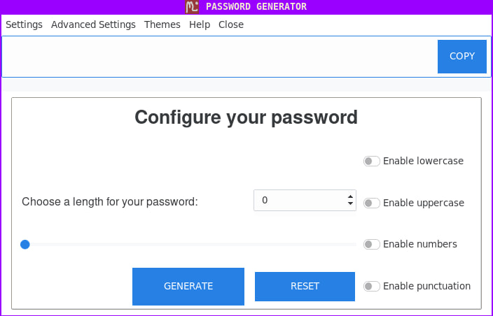
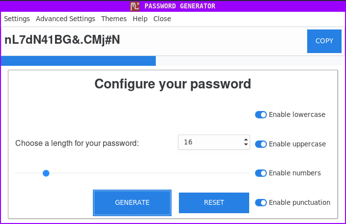

# Tkinter Password Generator

It is a simple, lightweight application built with Tkinter and Python. The purpose of this project is to create a user-friendly interface that generates secure passwords for users.

Features:

- User-friendly interface built with Tkinter
- Customizable password length
- Option to include uppercase, lowercase, numeric, and special characters
- Copy generated passwords to clipboard with a single click
- Password strength indicator
- Different themes


## Screenshots

### Program interface

### Generated password



## Installation

1. Clone the repository: 
``` console
git clone https://github.com/yevhen-martynenko/tkinter-password-generator.git
```

2. Create a virtual environment: 
``` console
python -m venv env
```

3. Activate the virtual environment: 
``` console
source env/bin/activate
``` 
For Windows users:
``` console
. env/bin/activate
```

4. Install the requirements: 
``` console
pip install -r requirements.txt
```


## Usage

1. Install the app

2. Change directory: 
``` console
cd password_generator
```

3. Run the app: 
``` console
python main.py
```

4. Customize your password preferences using the checkboxes and length scale

5. Click "Generate" to create a new password based on your settings


## License
<!-- TODO add license -->

## Project status
Development has concluded and is no longer ongoing.
